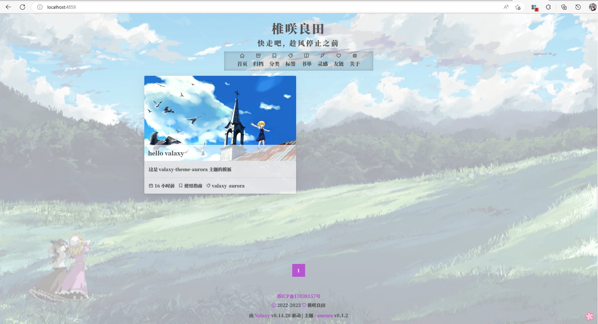

## 写在前面

[valaxy-theme-aurora](https://github.com/zmxlt/valaxy-theme-aurora) 是一款基于 [valaxy](https://valaxy.site/guide/getting-started) 的静态博客主题， 是 [aurora-vue](https://github.com/chanshiyucx/aurora) 主题的移植版本，本人只是做了一点小小的工作。

本人并没有做到完全复刻原主题，也没有完全适配 valaxy 内置的所有功能，而是移植出一个最小可用的主题版本。此处引用罗先生的经典名言：又不是不能用。


## 安装 nodejs

从官网下载 [nodejs](https://nodejs.org/en)，根据你的操作系统,选择不同的安装包，nodejs 版本推荐 16x 以上。

安装完成后， 推荐使用 pnpm 包管理工具。

```bash
npm -i g pnpm
```


## 使用 aurora 模板创建博客

1. 在 github 上访问 [valaxy-theme-aurora-template](https://github.com/zmxlt/valaxy-theme-aurora-template) 仓库。

2. 点击 Use The Template ，根据 Github 指引，创建仓库。

3. 从自己的仓库中进行克隆到本地。

```bash
git clone xxx.git
```

4. 进入目录，安装依赖。

```bash

pnpm i
```

5. 预览主题效果, 如果成功，那么预览效果，如图所示。

```bash
pnpm dev
```




## 主题配置

### 站点配置文件

站点配置文件为 `site.config.ts`, valaxy 提供了大量的配置选项，但本主题仅仅只适配了其中一小部分选项。

而所需的其余配置均放在博客主题配置文件中。

站点配置说明：

* `url` ： 博客的访问路径。
* `pageSize` ： 首页的展示数量。
* `title`： 浏览器 tab 栏打开此网页展示的信息。
* `description`： 给搜索引擎抓取后展示用的信息。
* `favicon`： 浏览器 tab 栏打开此网页的图表。
* `mediumZoom`： 文章中图片的放大查看功能，不用修改。

### 主题配置文件

主题配置文件为 `valaxy.config.ts`， 其中给出了该主题所有的配置文件，着重介绍需要修改的属性。

* `title`： 网站展示的标题。
* `subtile`： 副标题，可重置为空字符串 `''`。
* `author`: 博客的作者。
* `footer`: 网站的页脚，备案信息等。
* `panel`: 联系面板，其实就是一个图片 tab。
* `addons`: 评论功能，其中 `serverURL`，请按照注释链接，自行注册，并且进行替换。
* 其他都是一些风格样式，自行替换体验即可，其中 `menu` 的 `icon` 也是用的就是 `iconStyle` 的 `href` 的图标。


其中你能看到两种不同的图片引用方式，一种是 `/xxx.png`（绝对路径）和 `https://` (外链的形式)，如果是绝对路径，那么你需要将资源图片放在 `public` 目录下，如果是外链，请确保外链不会失效。

### public

public 目录存放的是公共资源，在 build 阶段，将会复制到 dist 目录下。

CNAME 文件，放的是你的网站域名，比如 `zmxlt.top` 或者他的子域名 `blog.zmxlt.top`。

其他文件，根据你的需求放入和替换。

### pages

pages 目录是用来存放 markdown 文件。 markdown 文件的顶部是 FrontMatter 字段，遵循 [YAML](https://www.runoob.com/w3cnote/yaml-intro.html) 语法规则。

所有对应页面的字段示例都已经写好，根据示例自行修改。其中 `comment` 字段是用来控制评论功能的开启。


### 关于文章创建及注意事项

0. 创建文件模板模板及使用。

参考 [自定义文章模板](https://valaxy.site/guide/custom/templates)， 即 `scaffolds/post.md` 文件

使用模板，需要全局安装 `valaxy` 。

```bash
pnpm -g i valaxy

# 创建新文件

pnpm new my_new_post
```

1. 针对 pages/posts/ 目录下的文章，目前版本请不要使用中文的文件名，之后 valaxy 可能会支持中文文件名。

2. 文章中 `date` 字段，请注意加上时区，如 `2023-05-02 08:00:00 +8`，因为 vite-ssg 默认的 UTC 0 时区。

3. 当然，你甚至还能使用文件夹进行管理（目前只能手动创建），如下。


```
post/
  test/
    index.md
    a.md
    b.png
```

`build` 阶段对应会生成 `/posts/test.html` 和 `/posts/test/a.html` 两个文件。 并且，你能够在 `md` 文件中采用相对路径的方式引用图片 `` 

## 部署

参考 [valaxy-部署](https://valaxy.site/guide/deploy)。

### 注意事项

* 如果不想采用 github actions 进行自动部署， 请删除 `.github` 目录
* 如果采用 github 想设置自定义域名，请参考 [Configuring a custom domain for your GitHub Pages site](https://docs.github.com/en/pages/configuring-a-custom-domain-for-your-github-pages-site)


## 写在最后

感谢云游君创造出很棒的事物，快来体验 valaxy 吧。

有任何想要咨询的事情，可以来这里提 [valaxy-theme-aurora issuses](https://github.com/zmxlt/valaxy-theme-aurora/issues)。

最后，感谢你的使用。

