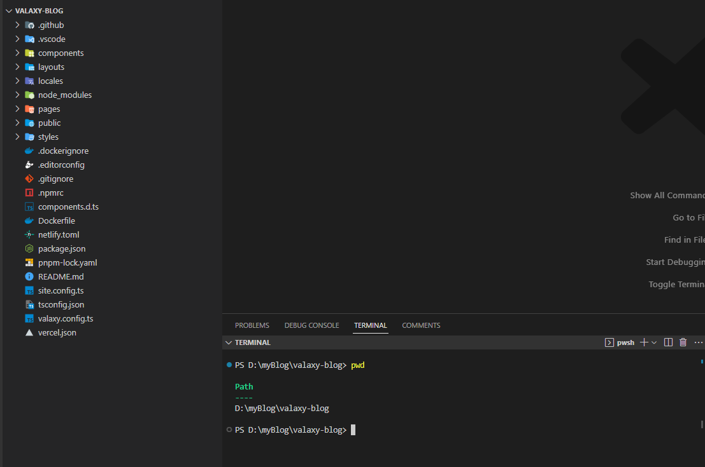

## 写在前面

valaxy-theme-aurora 是一款基于 [valaxy](https://valaxy.site/guide/getting-started) 的静态博客主题， 是[ aurora-vue](https://github.com/chanshiyucx/aurora) 主题的移植版本，本人只是做了一点小小的工作。

本人并没有做到完全复刻原主题，而是移植出一个最小可用的主题版本。此处引用罗先生的经典名言：又不是不能用。


## 安装 nodejs

从官网下载 [nodejs](https://nodejs.org/en)，根据你的操作系统,选择不同的安装包，nodejs 版本推荐 16x 以上。


## 创建博客

1. 创建博客目录，假设为 `myblog` 。
2. 进入此博客目录，打开命令行工具。
3. 安装 pnpm 包管理，推荐。
```bash
npm -i g pnpm

```

4. 创建博客，根据提示输入。假设博客名设置为 `valaxy-blog`，选择使用的包管理工具为 `pnpm` 。

```bash
pnpm create valaxy
```

5. 创建完成后，目录结构大概就是这样，此后，所有命令，均在 `./myblog/valaxy-blog` 目录下执行。



6. 安装 依赖

```bash
pnpm i
```

6. 预览默认主题效果

```bash
pnpm dev
```


## 使用 aurora 主题

编写中

